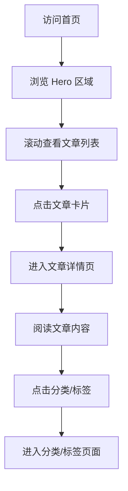
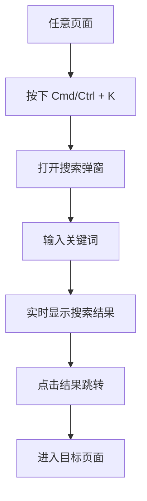

# 治愈系生活随笔博客 - 产品需求文档

## 1. 产品概述

一款面向生活记录、读书观影分享类博主的个人博客，主打氛围感与沉浸阅读体验。风格温暖柔和，适合记录日常、输出感性内容。

### 目标用户
- 生活记录爱好者
- 读书观影分享博主
- 追求温暖阅读体验的内容创作者

### 核心价值
- 治愈系视觉设计，营造温暖舒适的阅读氛围
- Markdown 原生支持，便于内容创作
- 响应式布局，适配桌面端与移动端

---

## 2. 核心功能

### 2.1 页面结构

| 页面 | 路由 | 功能描述 |
|------|------|----------|
| 首页 | `/` | 展示文章列表、侧边栏（博主信息、分类、标签云） |
| 文章详情 | `/article/:slug` | 展示完整文章内容、代码高亮、图片灯箱 |
| 关于 | `/about` | 博主介绍、关于页面 |
| 归档 | `/archive` | 按时间线展示所有文章 |
| 分类 | `/category/:name` | 展示特定分类下的文章 |
| 标签 | `/tag/:name` | 展示特定标签下的文章 |

### 2.2 功能模块

#### 首页模块
- **Hero 区域**：博客标题、标语、精选文章入口
- **文章列表**：卡片式展示，包含封面图、标题、摘要、发布日期、分类标签
- **侧边栏**：
  - 博主信息卡片（头像、昵称、简介）
  - 分类列表
  - 标签云
  - 社交链接

#### 文章详情模块
- **文章头部**：标题、发布日期、分类、标签、阅读时长
- **文章正文**：Markdown 渲染、代码高亮、图片点击放大
- **文章底部**：上一篇/下一篇导航、分享按钮

#### 导航栏模块
- **桌面端**：Logo、导航链接（首页、关于、归档）、搜索按钮
- **移动端**：汉堡菜单、侧滑导航
- **滚动行为**：滚动时背景从透明渐变为实色

#### 搜索模块
- **全局搜索**：支持文章标题、内容的模糊搜索
- **快捷键**：`Cmd/Ctrl + K` 唤起搜索

---

## 3. 视觉设计规范

### 3.1 配色体系

| 用途 | 色值 | 说明 |
|------|------|------|
| 主背景 | `#faf8f5` | 米白色 |
| 卡片背景 | `#ffffff` | 纯白 |
| 正文 | `#4a4a4a` | 深灰色 |
| 次要文本 | `#8a8a8a` | 中灰色 |
| 强调色 | `#b4846c` | 暖棕色 |
| 辅助色 | `#d7c4b8` | 浅奶茶色 |
| 边框色 | `#e8e4df` | 浅灰边框 |
| 阴影 | `0 2px 12px rgba(0,0,0,0.06)` | 柔和低饱和阴影 |

### 3.2 字体规范

| 用途 | 字体 | 字号 | 字重 |
|------|------|------|------|
| 标题（H1） | 思源宋体 / 楷体 | 32px | 600 |
| 标题（H2） | 思源宋体 / 楷体 | 26px | 600 |
| 标题（H3） | 思源宋体 / 楷体 | 20px | 500 |
| 正文 | 系统无衬线字体 | 15px | 400 |
| 辅助文字 | 系统无衬线字体 | 13px | 400 |

### 3.3 间距规范

- **基础间距单位**：4px
- **卡片内边距**：24px
- **卡片间距**：20px
- **区块间距**：48px
- **页面最大宽度**：1200px
- **主内容区宽度**：800px
- **侧边栏宽度**：300px

### 3.4 圆角与阴影

- **卡片圆角**：`8px`
- **按钮圆角**：`6px`
- **图片圆角**：`8px`
- **阴影**：统一使用 `0 2px 12px rgba(0,0,0,0.06)`

### 3.5 动效规范

| 动效类型 | 参数 | 说明 |
|----------|------|------|
| 卡片悬停 | `transform: translateY(-2px)` + 阴影加深 | 轻微上浮 |
| 图片加载 | `opacity: 0 → 1` 过渡 300ms | 淡入效果 |
| 路由切换 | 全局淡入淡出 300ms | Vue Transition |
| 导航栏滚动 | 背景透明 → 实色渐变 | 滚动触发 |

---

## 4. 技术架构

### 4.1 技术栈

| 模块 | 技术选型 | 版本 |
|------|----------|------|
| 核心框架 | Vue 3 | 3.4+ |
| 构建工具 | Vite | 5.x |
| 路由 | Vue Router | 4.x |
| 状态管理 | Pinia | 2.x |
| CSS 方案 | Tailwind CSS | 3.x |
| Markdown 解析 | vite-plugin-vue-markdown + Shiki | 最新稳定版 |
| 工具库 | VueUse、dayjs、@vueuse/head | 最新稳定版 |

### 4.2 项目结构

```
po_w/
├── public/                  # 静态资源
├── src/
│   ├── assets/             # 资源文件
│   │   ├── styles/        # 全局样式
│   │   └── images/        # 图片资源
│   ├── components/        # 公共组件
│   │   ├── layout/        # 布局组件
│   │   │   ├── Navbar.vue
│   │   │   ├── Sidebar.vue
│   │   │   └── Footer.vue
│   │   ├── article/       # 文章组件
│   │   │   ├── ArticleCard.vue
│   │   │   ├── ArticleList.vue
│   │   │   └── MarkdownRenderer.vue
│   │   └── common/        # 通用组件
│   │       ├── SearchModal.vue
│   │       └── ImageLightbox.vue
│   ├── composables/        # 组合式函数
│   │   ├── useTheme.ts
│   │   ├── useSearch.ts
│   │   └── useScroll.ts
│   ├── stores/            # Pinia 状态管理
│   │   ├── theme.ts
│   │   └── article.ts
│   ├── views/             # 页面组件
│   │   ├── HomeView.vue
│   │   ├── ArticleView.vue
│   │   ├── AboutView.vue
│   │   ├── ArchiveView.vue
│   │   ├── CategoryView.vue
│   │   └── TagView.vue
│   ├── router/            # 路由配置
│   │   └── index.ts
│   ├── utils/             # 工具函数
│   │   ├── date.ts
│   │   └── markdown.ts
│   ├── data/              # 静态数据
│   │   └── articles/      # Markdown 文章
│   ├── App.vue
│   └── main.ts
├── .trae/
│   └── documents/         # 文档目录
├── package.json
├── vite.config.ts
├── tailwind.config.js
├── tsconfig.json
└── index.html
```

---

## 5. 响应式布局

### 5.1 断点设计

| 断点 | 宽度 | 布局 |
|------|------|------|
| 桌面端 | ≥ 1024px | 两栏布局（主内容区 800px + 侧边栏 300px） |
| 平板端 | 768px - 1023px | 单栏布局，侧边栏折叠到底部 |
| 移动端 | < 768px | 单列布局，全宽卡片 |

### 5.2 移动端适配

- 侧边栏内容折叠到页面底部
- 导航栏变为汉堡菜单
- 卡片宽度自适应屏幕
- 图片支持手势缩放

---

## 6. 用户交互流程

### 6.1 首页浏览流程



### 6.2 搜索流程


